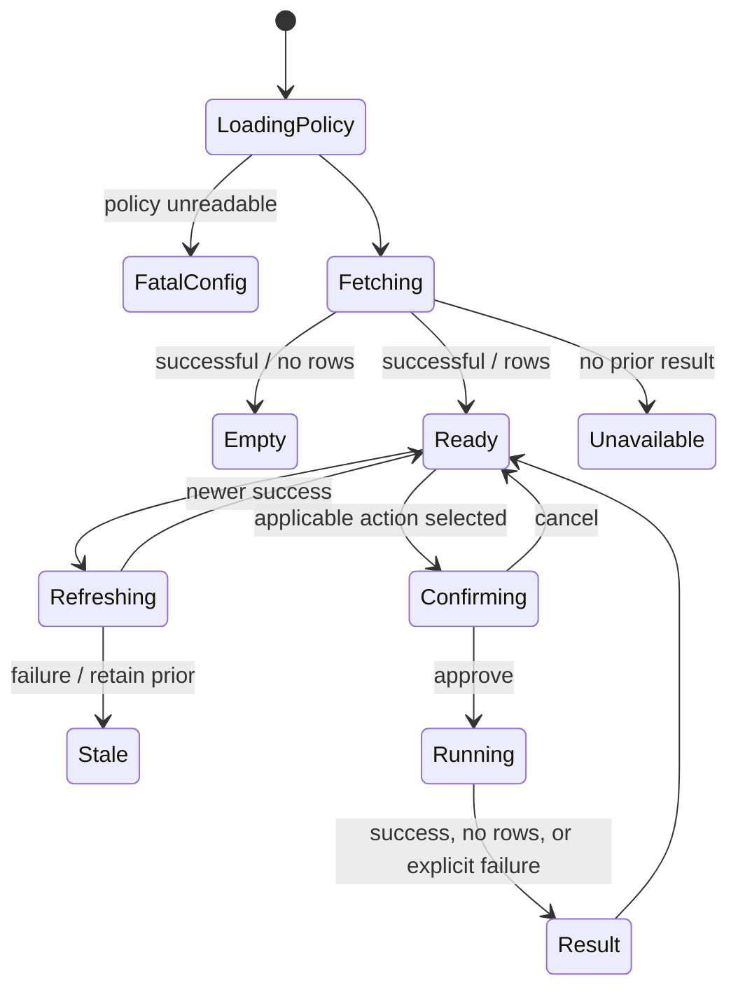

# Product wireframes

## Why these states

The terminal must preserve signal under stress and uncertainty. These proposals build on the implemented Textual queue, modal confirmation, result views, and separate supporting screens in `oce_sentry/tui/`.

## 1. Happy path: queue and incident detail

```text
+ OCE Sentry ---------------- data 18s ago ------------------------+
| SEV  AGE   FLAG  ENV   INCIDENT      TITLE       | DETAIL        |
| 2    18m   CUST  prod  [redacted]    ...         | status/owner  |
|>3    41m         prod  [redacted]    ...         | opened/age   |
| 3     2h   STALE test  [redacted]    ...         | monitor/reason|
|                                                  | evidence pack |
|                                                  | query: ready  |
|--------------------------------------------------+---------------|
| 3 open (others excluded/closed) | policy loaded | no action busy |
| r Refresh  p Payload  o Source  s Indicators  l Actions  q Quit  |
+------------------------------------------------------------------+
Annotation: runtime identifiers/details are redacted in this portfolio only.
```

Primary scan columns remain few; detailed provenance is one selection away.

## 2. Loading and refresh

```text
+ Loading scoped queue --------------------------------------------+
| Authenticating with ambient identity...                          |
| Loading required scope policy...                                 |
| Querying authoritative source...                                 |
| [Cancel/quit]                                                     |
+------------------------------------------------------------------+

+ Refreshing ------------------------------------------------------+
| Existing queue remains visible.                                  |
| Status: refreshing; selected row preserved.                      |
+------------------------------------------------------------------+
```

The implemented UI uses threaded fetches and generation IDs to prevent an older refresh from overwriting a newer one (`oce_sentry/tui/app.py`).

## 3. Empty states

```text
+ No active in-scope incidents -----------------------------------+
| Source succeeded  | fetched 12s ago | policy loaded              |
| Nothing is currently open and in scope.                           |
| [Refresh] [Open policy provenance]                                |
+------------------------------------------------------------------+

+ No applicable action -------------------------------------------+
| No deterministic query matches the selected monitor.             |
| Reason: required matching metadata is absent.                     |
| [Browse read-only skills] [Open reference] [Compose payload]      |
+------------------------------------------------------------------+
```

Successful empty, missing metadata, and missing installation must be distinct.

## 4. Source error with retained stale data

```text
+ SOURCE UNAVAILABLE ----------------------------------------------+
| Last successful data: 9m ago. Showing 3 last-known incidents.     |
| Failure category: authentication / network / query                |
| [Retry] [Readiness] [Open authoritative system]                   |
|                                                                  |
| Existing rows remain visible with STALE banner and age.           |
+------------------------------------------------------------------+
```

This reflects `_apply_incidents`: known data stays, but the failure is explicit.

## 5. Action confirmation and running

```text
+ Confirm one investigation --------------------------------------+
| Action: first-look-query                                         |
| Applies to: selected incident                                    |
| Executes locally as your signed-in identity                      |
| Declared effects: read-only / [explicit write paths if any]       |
| Command arguments:                                               |
|   executable                                                     |
|   fixed option                                                   |
|   incident argument [redacted]                                   |
| [Esc Cancel]                                           [Y Run]   |
+------------------------------------------------------------------+

+ Running ---------------------------------------------------------+
| [spinner] first-look-query against selected incident              |
| Started 7s ago | timeout policy visible                           |
| Duplicate start disabled                                         |
+------------------------------------------------------------------+
```

## 6. Result and edge states

```text
+ Result: first-look-query ----------------------------------------+
| OK in 4.1s | 23 rows | source timestamp | output saved locally   |
| [wide result uses full terminal width]                            |
| [Open in data explorer] [Open saved output] [Back to queue]       |
+------------------------------------------------------------------+

+ Completed with no rows -----------------------------------------+
| SUCCESS: query ran and found no matching rows.                    |
| This is evidence, not an execution failure.                       |
+------------------------------------------------------------------+

+ Timed out / partial ---------------------------------------------+
| FAILED: timed out under configured limit.                         |
| stdout retained | stderr visible | no success-shaped fallback     |
| [Retry] [Open exact command] [Back]                               |
+------------------------------------------------------------------+
```

Illustrative values above are wireframe placeholders, not measured product results.

## 7. Narrow terminal

```text
+ OCE Sentry (narrow) ----------------+
| SEV AGE FLAG ENV INCIDENT TITLE      |
|>3   41m      prod [redacted] ...     |
|--------------------------------------|
| Enter: open detail   r: refresh      |
+--------------------------------------+
```

At narrow widths, hide the side pane and open detail as a full-screen view rather than compressing the title into unreadability.

## State model



## Accessibility and responsive notes

- Preserve full keyboard operation and screen-scoped key bindings.
- Pair severity, stale, customer-impact, success, and failure colors with text.
- Announce refresh/action start and completion without stealing focus.
- Confirmation must expose exact effects in a linear reading order.
- Data tables need descriptive headers and a detail alternative for truncated cells.
- Respect terminal width and avoid horizontal scrolling for the primary queue; wide results get a dedicated view.
- Never place runtime incident content, identities, commands containing credentials, or internal endpoints in analytics.
